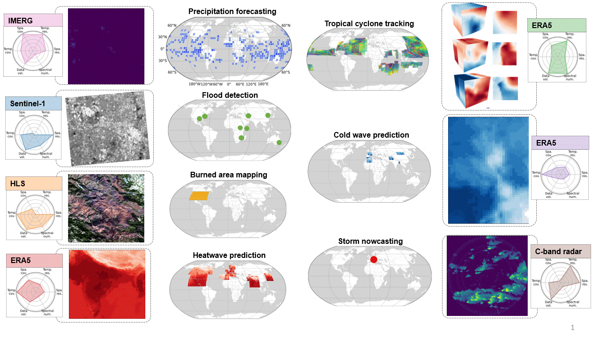

# Extreme Earth Benchmark

## Extreme events

## Dataset

<p align="center">
  
</p>

The dataset is available in [Hugging Face](https://huggingface.co/datasets/zhaoshan/ee-bench_v1.0/tree/stable/data)

To download the dataset, use ``earthextremebench/earthextremebench_download.py``
## Instruction
To get the task on one extreme event ```ee_task = EETask(disaster="coldwave")```

To get the dataset ```ee_task.get_loader()```

To train and test the model ```ee_task.train_and_evaluate(seed=42, mode="fully_finetune")```


